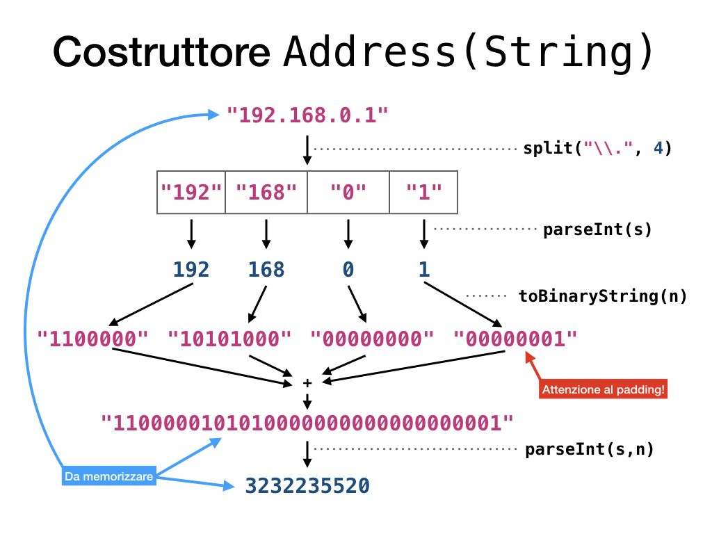

# IP Calcultor. Assignment 1

## La classse `Address`
L’obiettivo di questo lavoro è creare una “calcolatrice” per gli indirizzi IP. Per ridurre la complessità dell’esercizio questo verrà diviso in diversi assignment.

Create in Java una classe `Address` che funzionerà da modello per un generico indirizzo IP. Al suo interno la classe dovrà contenere almeno i campi:
* Valore decimale puntato dell’indirizzo (es: 192.168.0.1), chiamato in inglese
decimal dotted quad;
* Valore binario dell’indirizzo (es: 11000000101010000000000000000001);
* Valore decimale dell’indirizzo (es: 3232235520).

Queste variabili non dovranno essere modificabili dall’esterno della classe, quindi impostate opportunamente i _getter_ e _setter_ delle proprietà per renderle read-only.

La classe deve poter istanziare un oggetto “indirizzo” costruendolo a partire da una stringa decimale puntata (es: `new Address("192.168.0.1")`) oppure da un valore intero a 32 bit. Ogni costruttore deve inizializzare tutte e tre le proprietà dell’oggetto.
Realizzare quindi tutti i metodi di conversione tra formati che ritenete necessari per poter inizializzare correttamente l’oggetto e le sue proprietà.
Attenzione ad impostare correttamente la visibilità pubblica e privata dei metodi e delle variabili. In generale vale la regola: tutto ciò che non deve necessariamente essere pubblico, deve rimanere privato.

## Output
Realizzare degli opportuni metodi di output che consentano di visualizzare a video in modo pulito e ordinato l’indirizzo IP in formato decimale puntato e in formato binario puntato.

I metodi di output dovrebbero essere differenti dai getter, anche se questi fanno la stessa cosa. Non è detto che le funzionalità di questi metodi saranno identiche per sempre.

Idealmente, nominando questi metodi `getDecimalDottedQuads()` e `getDottedBinary()`,
dovreste poter utilizzare la classe `Main` di test già impostata in questo esercizio.

## Obiettivo extra
Realizzare dei metodi interni alla classe in grado di garantire una prima forma di correttezza dell’input. In particolare non deve essere possibile creare un oggetto Address se il parametro passato ha dei valori fuori dai range [0-223].[0-255].[0-255].[0-255].

Per ora potete dare per scontato che venga passata una stringa in formato decimale
puntato. Lasciamo ad un assignment futuro il controllo totale della correttezza dell’input.

## Suggerimenti
Abituatevi ad usare il Javadoc (attenzione: il link è per la versione 13 di Java, ma dovreste cercare ed usare la versione su cui state lavorando) per cercare funzionalità che possono esservi utili.

In questa prima parte potrebbero esservi utili:
* `Integer.toBinaryString(int)`
* `Integer.parseUnsignedInt(String s, int n)`
* `String.split(String regex)` (come espressione regolare da passare per parametro
usare `\\.`. Per approfondimenti sulle espressioni regolari potete consultare il sito internet www.regular-expressions.info)

I passaggi di conversione del costruttore dovranno seguire all’incirca il seguente schema.

Ponete particolare attenzione alla gestione del segno nell’ultima conversione; di default la primitiva int memorizza i numeri in complemento a due, quindi il primo bit equivale al segno. Se la vostra stringa binaria comincia con un 1 la sua versione decimale sarà un numero negativo. Siate coerenti nella conversione e nell’utilizzo di `parseInt()` o `parseUnsignedInt()` per non commettere errori nella conversione.

Fate anche attenzione a non complicare eccessivamente il costruttore. Per far sì che il
codice resti pulito e ordinato il costruttore dovrebbe, per quanto possibile, semplicemente richiamare delle funzioni che si occupano di fare i calcoli. Ogni funzione dovrebbe isolare una particolare funzionalità o calcolo, e rimanere il più generale possibile per poterla riutilizzare in altri punti del codice.

Si lascia allo studente la progettazione e realizzazione del costruttore inverso, ovvero che parte dal numero decimale e calcola la stringa binaria e la forma decimale puntata.